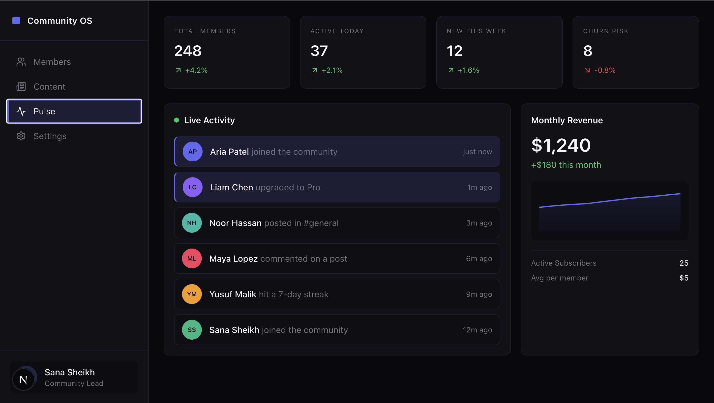

# Community OS

A high-fidelity, dark-themed community management dashboard built to demonstrate design-engineering craft — pixel-precise components, interaction polish, and an AI-assisted development workflow.

**[Live Demo →](https://community-os-chi.vercel.app)**



---

## What it is

Community OS is a fully interactive prototype of a community platform admin dashboard — the kind of tool a creator, educator, or business would use to manage their members, content, and revenue in one place.

It was built as a design engineering portfolio piece, with the goal of demonstrating what it looks like to take a product concept from idea to high-fidelity implementation — fast, and with care.

---

## Views

**Members** — A filterable member table with avatar initials, engagement score progress bars, status badges (Active / At Risk / Churned), and MRR per member. Clicking any row opens a split-pane detail panel with a stats grid, activity timeline, and quick actions.

**Content** — A post feed with space filter pills, post type icons, pinned indicators, and engagement stats (likes, comments, views). Supports filtering by space (#general, #announcements, #introductions, #resources).

**Pulse** — A live activity dashboard with real-time faked event streaming, community stat cards, and an MRR sparkline chart. New events prepend to the feed every 6 seconds with staggered animations.

**Settings** — A two-column settings panel with sections for General, Members, Notifications, Billing, and Danger Zone. Includes toggle switches, form inputs, and a current plan card.

**⌘K Command Palette** — Global search and navigation accessible from anywhere. Search members by name, email, or role. Navigate between views. Trigger actions. Full keyboard navigation.

---

## Interactions worth noting

- Split-pane detail panel that expands by animating width in the flex row — no absolute positioning, no layout jump
- Member detail panel renders as a bottom sheet on mobile
- Spring-physics animations on panel open/close (Framer Motion)
- Staggered entrance animations on lists and stat cards
- Live activity feed with AnimatePresence — items animate in from the top, old items animate out
- Sidebar collapses to icon-only on tablet, bottom nav on mobile
- Responsive column visibility on the members table (fewer columns on smaller screens)
- Online now pulse dot (ping animation) for active members

---

## Tech stack

- **Next.js 15** (App Router, React Server Components)
- **TypeScript** — strict throughout
- **Tailwind CSS** — custom design tokens via CSS variables
- **shadcn/ui** — component primitives (ScrollArea, etc.)
- **Framer Motion** — all transitions and animations
- **cmdk** — command palette
- **Recharts** — MRR sparkline
- **Lucide React** — icons
- **React Compiler** — enabled for automatic memoization

---

## Design system

All colors are defined as CSS custom properties in `globals.css`, with a dual-token system:

- shadcn HSL tokens for component compatibility (`--background`, `--foreground`, etc.)
- Raw `--os-*` tokens for direct use in components (`--os-accent`, `--os-surface`, `--os-status-active`, etc.)

The dark theme is the default and only theme. No light mode.

---

## AI-assisted development workflow

This project was built using an AI-first development approach — the same workflow I use professionally and the same one Circle describes in their design engineer role.

**Tools used:**
- **Cursor** — primary editor, used for in-context AI generation and refinement
- **Claude** — used for architecture decisions, prompt crafting, and critique loops

**How it worked in practice:**

Each feature was built in a loop:
1. Write a detailed prompt describing the component, its props, state, interactions, and styling constraints
2. Generate a starting point with Cursor
3. Review the output critically — check visual fidelity, interaction behavior, accessibility, and code quality
4. Refine manually where AI output didn't match intent (spacing, motion curves, edge cases)
5. Screenshot → critique → iterate

AI was used to generate fast starting points, not final outputs. Every component was reviewed and refined by hand — spacing, motion timing, color consistency, and responsive behavior were all manually adjusted after generation.

The prompts were written to be specific about design intent, not just functionality. For example, rather than "build a sidebar", the prompt specified active state behavior, border colors, hover transitions, icon sizing, and the user section layout — because vague prompts produce generic results.

---

## Project structure

```
src/
├── app/
│   ├── globals.css          # Design tokens + base styles
│   ├── layout.tsx           # Root layout
│   └── page.tsx             # Shell layout + view routing
├── components/
│   ├── sidebar.tsx          # Responsive sidebar + bottom nav
│   ├── panel-context.tsx    # Global panel state
│   ├── command-palette.tsx  # ⌘K palette
│   ├── members/
│   │   ├── members-table.tsx
│   │   ├── member-detail-panel.tsx
│   │   └── status-badge.tsx
│   ├── content/
│   │   └── content-view.tsx
│   ├── pulse/
│   │   └── pulse-view.tsx
│   └── settings/
│       └── settings-view.tsx
└── lib/
    └── data/
        ├── members.ts
        ├── content.ts
        └── pulse.ts
```

---

## Running locally

```bash
git clone https://github.com/shanza-hameed/community-os
cd community-os
npm install
npm run dev
```

Open [http://localhost:3000](http://localhost:3000).

---

## About

Built by [Shanza Hameed](https://linkedin.com/in/shanza-hameed) — Senior Frontend Engineer specializing in design-engineering, component systems, and AI-assisted prototyping.
